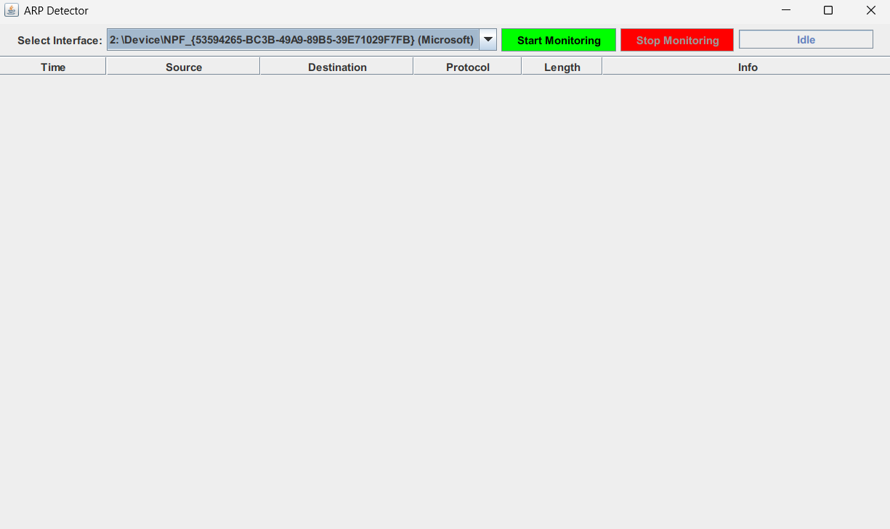
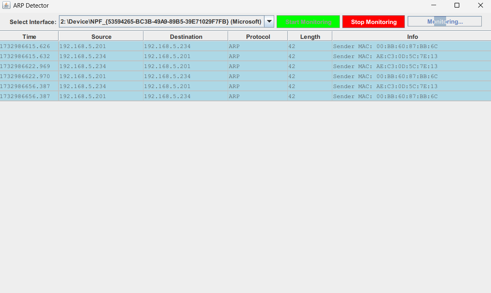

# ArpDetector

ArpDetector is a Java-based application designed to monitor ARP packets in real-time. It provides a graphical interface inspired by Wireshark to detect potential ARP spoofing attacks in a local network.

### Main Interface


### Detection in Action



## Features

- **Real-Time Packet Monitoring**: Capture and display ARP packets from selected network interfaces.
- **Attack Detection**: Automatically detects and flags suspicious ARP activity (potential spoofing attacks).
- **Color-Coded Table**:
  - **Safe Rows**: Blue background for normal traffic.
  - **Attack Rows**: Red background for suspected ARP spoofing attempts.
- **Error Notifications**: Displays a pop-up message when ARP spoofing is detected.
- **Customizable Interface**:
  - Select network interfaces for monitoring.
  - Start and stop monitoring with an intuitive GUI.

---

## Prerequisites

1. **Java Development Kit (JDK)**: Ensure JDK 8 or later is installed.
2. **jpcap Library**: 
   - Download and include the `jpcap` library.
   - Ensure the `jpcap` library is correctly set in your project's classpath.

---

## Installation

1. Clone this repository:
   ```bash
   git clone https://github.com/alla-guerrcihe/ArpDetector.git
   cd ArpDetector
## How to Use
1. Select Network Interface: Use the dropdown to select the network interface you wish to monitor.
2. Start Monitoring: Click the "Start Monitoring" button to begin capturing ARP packets.

**View Results:**
- Normal traffic rows are highlighted in blue.
- Suspicious ARP spoofing attempts are flagged in red, and a notification will appear.
- Stop Monitoring: Click "Stop Monitoring" to end the capture session.
